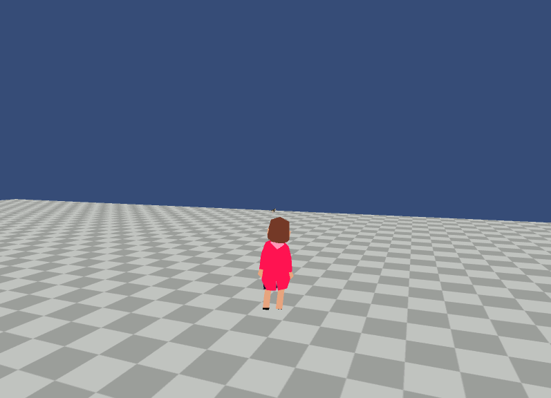

This is a Unity practice project.

Pretend to photograph a bird as you sneak up on it.
The bird reacts to sight and the sound of your footsteps.

Controls :

WASD / Left Analog Stick - Movement

Mouse / Right Analog Stick - Rotate Camera

Shift - Sneak

Ctrl / Down - Crouch

Right Click / Left Bumper - Aim Camera

Left Click / Right Bumper - Snap Photo (while aiming)